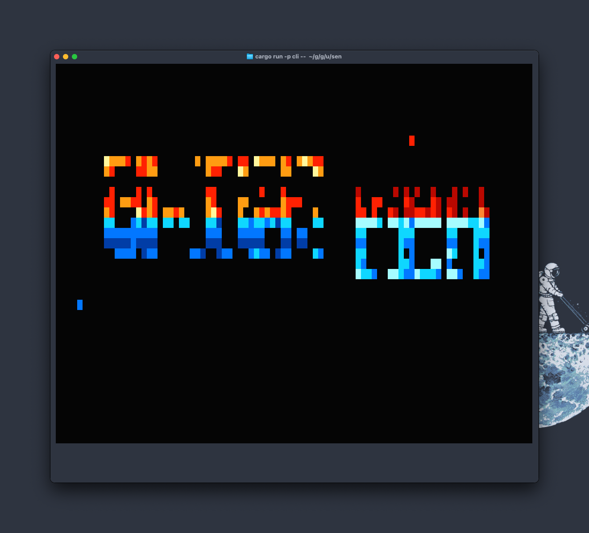

<h1 align="center">:space_invader: SEN</h1>

<h2 align="center"><em>NES emulator written in Rust</em></h2>

## lib

CPU, PPU, APU の実装と Renderer, Speaker, JoypadHandler の定義があります。

## cli

ターミナル上で動作させるための実装が入っています。
Speaker は実装されていないので音声は鳴りません。

## pc

PC 上で動作させるための実装が入っています。
SDL2 で動作します。

## web

Web 上で動作させるための実装が入っています。
https://uzimaru.dev/sen で実際に試せます。
iNES ファイルを画面にドラッグ&ドロップして、表示されたカセットを中央のゲーム機にドラッグしてください。
テレビの画面をクリックすることで拡大表示されます。
